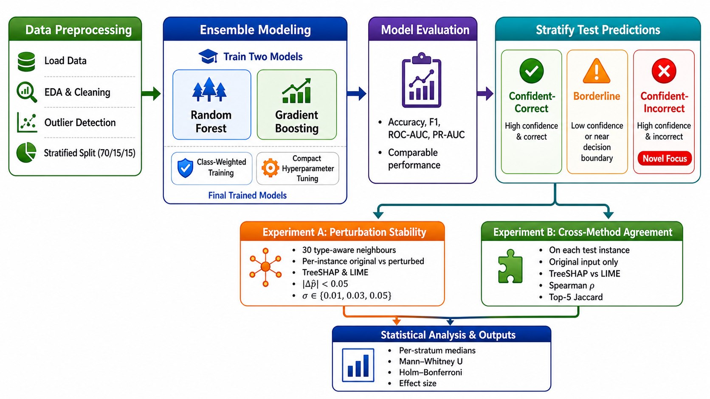

# Beyond Accuracy: Explanation Instability Under Decision Uncertainty in Credit Risk Classification

A reproducible study of **how stable post-hoc explanations are** for credit-default classifiers when the model itself is uncertain. We show that explanation stability collapses precisely in the region where model decisions matter most: the **borderline zone** and, especially, the **confident-but-wrong zone** — exactly where a loan officer would lean on the explanation to overrule the score.

RQ:
How does the reliability of post-hoc explanations for ensemble credit-default models — measured both as within-method stability under input perturbation and as cross-method agreement between TreeSHAP and LIME — vary across strata defined jointly by decision confidence and correctness, and in particular on Confident-Incorrect predictions?
---

## 📐 Experimental framework



The pipeline runs end-to-end inside a single notebook:

1. **UCI Default of Credit Card Clients** (30,000 instances, 23 features).
2. **Preprocessing & 70 / 15 / 15 stratified split** — cleaning, encoding, scaling.
3. **Train two models with class weights** — Random Forest (bagging) and Gradient Boosting (boosting).
4. **Stratify the 4,500 test predictions** into three decision regions:
   - **Confident-Correct** — `p̂ ≤ 0.20` or `p̂ ≥ 0.80`, prediction matches the label.
   - **Borderline** — `0.40 ≤ p̂ ≤ 0.60`, any outcome.
   - **Confident-Incorrect** — `p̂ ≤ 0.20` or `p̂ ≥ 0.80`, prediction is wrong. *(Novel focus of this study.)*
5. **Run two experiments** on each stratum:
   - **Experiment A — Perturbation Stability:** 30 type-aware neighbours per instance, `|Δp̂| < 0.05` filter, TreeSHAP and LIME on each neighbour.
   - **Experiment B — Cross-Method Agreement:** TreeSHAP vs. LIME on the original instance, pairwise Spearman ρ and Top-5 Jaccard.
6. **Statistical analysis** — per-stratum medians, Mann–Whitney U with Holm–Bonferroni correction, rank-biserial effect size.

---

## 🔑 Headline metrics

| Metric | What it captures |
|---|---|
| **Spearman ρ** | Whether the *whole ranking* of feature attributions is preserved. |
| **Top-5 Jaccard** | Whether the *most influential five* features are preserved — closer to what a human reviewer actually reads. |
| **Mann–Whitney U + Holm–Bonferroni** | Non-parametric test for between-stratum differences with family-wise error correction. |
| **Rank-biserial r** | Effect-size companion to U so we report magnitude, not just *p*. |

---

## 🗂️ Repository contents

```
.
├── Credit_XAI.ipynb                     # main notebook (all figures inline)
├── Framework.png                        # the framework diagram above
├── outputs/                             # PNG/PDF copies of every figure
└── README.md
```

The notebook itself is organised into 16 sections that mirror the framework:

| § | Section | Visual output |
|---|---|---|
| 1–3 | Environment, imports, configuration | — |
| 4 | Data loading + 70/15/15 split | EDA: target balance, default rate by gender, age histogram, correlation heatmap |
| 5 | Train RF + GBM | Validation-AUC sweep bar charts |
| 6 | Test-set performance | **Confusion-matrix heatmaps**, ROC curves, PR curves, predicted-probability histograms |
| 7 | Three-stratum stratification | Stratum scatter + counts |
| 8–9 | Stability metrics + type-aware perturber | — |
| 10 | TreeSHAP + LIME explainers | **Global SHAP beeswarm**; **per-instance SHAP before vs. after perturbation**; per-stratum beeswarms |
| 11 | Experiment A — perturbation stability | Per-stratum boxplots + stripplots; σ-sweep robustness check |
| 12 | Experiment B — cross-method agreement | Heatmap + violin |
| 13 | Mann–Whitney U + Holm–Bonferroni | Rank-biserial heatmap with significance stars |
| 14 | Summary | Stratum-median bars; global feature importance |

---

## ▶️ Quick start

### Option 1 — Google Colab (recommended)

1. Open `Credit_XAI_Result_Visualized.ipynb` in Colab.
2. Runtime → Run all.
3. The first cell installs `shap`, `lime`, `lightgbm`, `ucimlrepo` automatically.
4. The final cell zips `outputs/` and offers a download.

### Option 2 — Local

```bash
git clone https://github.com/<your-handle>/credit-xai-stability.git
cd credit-xai-stability

python -m venv .venv && source .venv/bin/activate
pip install -U pip
pip install numpy pandas scikit-learn lightgbm shap lime \
            matplotlib seaborn scipy ucimlrepo jupyter

jupyter notebook Credit_XAI_Result_Visualized.ipynb
```

Set `random_state = 42` is hard-coded throughout, so results reproduce exactly.

---

## ⚙️ Key configuration knobs

All defined in §3 of the notebook:

```python
SEED                     = 42
TRAIN_FRAC, VAL_FRAC     = 0.70, 0.15        # remainder = test
N_PERTURBATIONS          = 30                # neighbours per instance
PERTURB_SIGMA_HEADLINE   = 0.03              # numeric jitter scale
PERTURB_SIGMA_SWEEP      = (0.01, 0.05)      # robustness sweep
PRED_STABILITY_FILTER    = 0.05              # |Δp̂| < this kept
CONFIDENT_LO, CONFIDENT_HI = 0.20, 0.80      # stratum band edges
BORDERLINE_LO, BORDERLINE_HI = 0.40, 0.60
TOP_K_JACCARD            = 5
```

The σ sweep (`0.01 / 0.03 / 0.05`) is the headline robustness check. We report headline numbers at σ = 0.03 and show the trend in §11.2.

---

## 📊 What the figures show

- **§6.1 confusion-matrix heatmaps** (count + row-normalised %) — both models.
- **§10.1 SHAP beeswarm** — global view, RF and GBM.
- **§10.2 SHAP before vs. after perturbation** — one instance per stratum, side-by-side bar charts. *This is where the instability becomes visible*: stable explanations look almost identical across the pair, unstable ones flip rankings.
- **§11.1 Figure A** — boxplots + stripplots of per-instance ρ and Top-5 Jaccard, faceted by stratum (green / amber / crimson).
- **§12.1 Figure B** — cross-method agreement heatmap (RdYlGn) plus a violin showing the full distribution.
- **§13.1 Figure C** — rank-biserial effect sizes with `*` / `**` / `***` overlays for Holm-corrected significance.

---

## 🧾 Citation

If you use this notebook or its results, please cite:

```bibtex
@misc{aldowaihi2025xai,
  title  = {Beyond Accuracy: Explanation Instability Under Decision
            Uncertainty in Credit Risk Classification},
  author = {Aldowaihi, Dalal},
  year   = {2025}
}
```

UCI source: *Default of Credit Card Clients* — Yeh, I.-C. & Lien, C.-H. (2009).

---

## 📝 License

Released under the **MIT License**. See `LICENSE` for details.

Dataset is © its original authors and is used here under UCI ML Repository terms.
